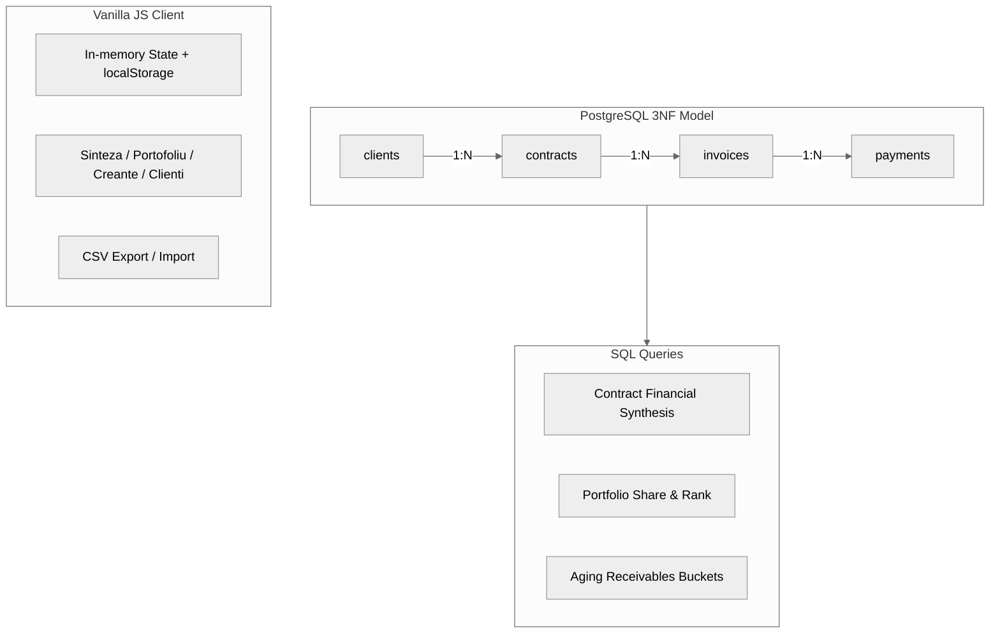

# bitfact-dashboard

B2B contract and receivables management dashboard built for my university practica project (proposed for an accounting firm managing paying clients).


## Romana

### Scopul Proiectului

Proiectul tine evidenta contractelor, incasarilor si restantelor per client. Are doua parti, pe acelasi model de date:

1. O baza de date PostgreSQL in 3NF (`sql/`), cu interogari analitice pentru sinteza financiara, cotele din portofoliu si vechimea creantelor.
2. Un dashboard HTML/CSS/JS fara framework-uri, care ruleaza integral in browser si isi salveaza datele in `localStorage`, deci functioneaza fara server si fara build tools.



Nota: partea din browser nu se conecteaza la PostgreSQL. Stratul SQL arata designul relational normalizat; dashboard-ul foloseste in schimb un format simplu, un rand per contract (`total_value_eur`, `collected_amount`, `overdue_amount`, `due_date`, `status`), pentru ca un demo client-side nu are un backend care sa faca join-urile.

---

### 1. Schema Bazei de Date (`sql/01-schema_ddl.sql`)

Patru tabele in 3NF, cu constrangeri CHECK pe sume si date, chei unice unde e cazul si indecsi pe toate cheile externe:

| Tabela | Cheie Primara | Chei Externe | Constrangeri / Indecsi Cheie |
| :--- | :--- | :--- | :--- |
| **`clients`** | `id` (SERIAL) | — | `UNIQUE(fiscal_code)`, `UNIQUE(contact_email)` |
| **`contracts`** | `id` (SERIAL) | `client_id -> clients(id)` | `CHECK(end_date >= start_date)`, `idx_contracts_client`, `idx_contracts_status` |
| **`invoices`** | `id` (SERIAL) | `contract_id -> contracts(id)` | `CHECK(amount_eur >= 0)`, status (`unpaid`, `paid`, `overdue`), `idx_invoices_contract`, `idx_invoices_status` |
| **`payments`** | `id` (SERIAL) | `invoice_id -> invoices(id)` | `CHECK(amount_paid_eur >= 0)`, metoda de plata (`transfer`, `card`, `cash`), `idx_payments_invoice` |

### 2. Interogari Analitice (`sql/02-analytics.sql`)

1. **Sinteza Financiara per Contract**: CTE-uri care calculeaza total facturat, total incasat si restante per contract, apoi rata de colectare.
2. **Cota din Portofoliu**: ponderea fiecarui client din venituri, calculata cu `SUM() OVER ()` si clasata cu `DENSE_RANK()`.
3. **Vechimea Creantelor**: facturile neincasate sunt grupate dupa zilele de intarziere (`Current`, `1-30`, `31-60`, `61-90`, `>90`) ca sa se vada unde se concentreaza riscul de neplata.

### 3. Dashboard Web (`index.html`, `app.js`, `styles.css`)

Aplicatie single-page, fara framework-uri sau dependinte:

* **Date**: contractele sunt tinute in memorie si salvate in `localStorage`; la prima rulare se incarca un set de 200 de inregistrari definit in `app.js`. Contractele adaugate din interfata se salveaza peste acest set.
* **Sinteza**: carduri KPI (contractat, incasat, restant), o bara cu fluxul de numerar si un tabel paginat cu cautare si sortare.
* **Portofoliu**: toate contractele, cu filtre pe status si industrie.
* **Creante**: grupele de vechime calculate din campul `due_date`; contractele fara scadenta apar la "Fara scadenta".
* **Clienti**: top clienti dupa valoare contractata, cu cota din portofoliu.
* **CRUD**: adaugare/editare printr-un formular modal (codurile duplicate sunt respinse), stergere cu confirmare si un panou cu detalii per contract.
* **Export/import CSV**: functional, cu suport pentru campuri intre ghilimele.

---

### Ghid de Executie Locala

#### Scripturi Baza de Date

1. Conectare la PostgreSQL si crearea bazei de date:
   ```sql
   CREATE DATABASE bitfact_db;
   \c bitfact_db
   ```
2. Rularea scripturilor de schema si analiza:
   ```bash
   psql -U postgres -d bitfact_db -f sql/01-schema_ddl.sql
   psql -U postgres -d bitfact_db -f sql/02-analytics.sql
   ```

#### Dashboard Web

Nu sunt necesare build tools sau package managers.

* Deschide `index.html` direct in browser:
  ```powershell
  Start-Process index.html
  ```
* Sau ruleaza un server HTTP:
  ```bash
  python -m http.server 8000
  ```
  apoi deschide `http://localhost:8000`.

Scurtaturi: `/` cautare, `N` contract nou, `E` export CSV, `P` print, `T` schimba tema, `Esc` inchide dialogurile.

---

### Structura Repozitoriului

* **[index.html](index.html)**: Markup-ul aplicatiei, formularul modal si panoul de detalii.
* **[app.js](app.js)**: Starea aplicatiei, calculele KPI, randarea tabelelor, CRUD si logica CSV.
* **[styles.css](styles.css)**: Design system cu variabile CSS, teme light/dark si layout.
* **[sql/01-schema_ddl.sql](sql/01-schema_ddl.sql)**: Schema PostgreSQL 3NF, constrangeri si indecsi.
* **[sql/02-analytics.sql](sql/02-analytics.sql)**: Interogari analitice cu CTE-uri si functii fereastra.

### Stadiul Proiectului

- [x] DDL baza de date (`sql/01-schema_ddl.sql`)
- [x] Interogari analitice (`sql/02-analytics.sql`)
- [x] Dashboard client-side (`index.html`, `styles.css`, `app.js`)
- [x] CRUD in browser cu persistenta localStorage
- [x] Export/import CSV

---

## English

## Project Purpose

The project tracks contracts, collections, and overdue exposure per client. It consists of two parts that share the same domain model:

1. A PostgreSQL warehouse designed in 3NF (`sql/`), with analytical queries for financial synthesis, portfolio concentration, and receivables aging.
2. A vanilla HTML/CSS/JS dashboard that runs entirely client-side, backed by `localStorage`, so it works without any server or build step.


Note: the browser client does not connect to PostgreSQL. The SQL layer documents the normalized design; the dashboard deliberately uses a flat per-contract record (`total_value_eur`, `collected_amount`, `overdue_amount`, `due_date`, `status`) since a client-side demo has no backend to join against.

---

## 1. Database Schema (`sql/01-schema_ddl.sql`)

Four tables in Third Normal Form, with CHECK constraints on monetary amounts and dates, unique keys on natural identifiers, and indexes on all foreign keys:

| Table | Primary Key | Foreign Keys | Key Constraints / Indexes |
| :--- | :--- | :--- | :--- |
| **`clients`** | `id` (SERIAL) | — | `UNIQUE(fiscal_code)`, `UNIQUE(contact_email)` |
| **`contracts`** | `id` (SERIAL) | `client_id -> clients(id)` | `CHECK(end_date >= start_date)`, `idx_contracts_client`, `idx_contracts_status` |
| **`invoices`** | `id` (SERIAL) | `contract_id -> contracts(id)` | `CHECK(amount_eur >= 0)`, status state machine (`unpaid`, `paid`, `overdue`), `idx_invoices_contract`, `idx_invoices_status` |
| **`payments`** | `id` (SERIAL) | `invoice_id -> invoices(id)` | `CHECK(amount_paid_eur >= 0)`, payment method audit (`transfer`, `card`, `cash`), `idx_payments_invoice` |

## 2. Analytical Queries (`sql/02-analytics.sql`)

1. **Contract Financial Synthesis**: CTEs aggregate invoiced volume, collected cash, and overdue exposure per contract, joined back to compute the collection rate.
2. **Portfolio Concentration**: revenue share per client via `SUM() OVER ()`, ranked with `DENSE_RANK()`.
3. **Receivables Aging**: unpaid invoices bucketed by days past due (`Current`, `1-30`, `31-60`, `61-90`, `>90`) to expose default risk concentrations.

## 3. Web Dashboard (`index.html`, `app.js`, `styles.css`)

Single-page app, no frameworks or dependencies:

* **State & persistence**: contracts live in memory and are cached in `localStorage`; on first run they fall back to a 200-record seed dataset defined inline in `app.js`. New contracts added through the UI persist on top of the seed.
* **Sinteza**: KPI cards (contracted, collected, overdue), cashflow breakdown bar, and a paginated contract ledger with search and column sorting.
* **Portofoliu**: full contract list with status filters and an industry filter.
* **Creante**: receivables aging buckets computed from real `due_date` values; contracts without a due date are grouped under "Fara scadenta".
* **Clienti**: top clients by contracted value with portfolio share.
* **CRUD**: add/edit contracts through a modal form (duplicate contract codes are rejected), delete with confirmation, detail drawer per contract.
* **CSV export/import**: round-trip safe, quoted-field aware.

---

## Local Execution Guide

### Database Scripts

1. Connect to PostgreSQL and create the database:
   ```sql
   CREATE DATABASE bitfact_db;
   \c bitfact_db
   ```
2. Run the schema and analytics scripts:
   ```bash
   psql -U postgres -d bitfact_db -f sql/01-schema_ddl.sql
   psql -U postgres -d bitfact_db -f sql/02-analytics.sql
   ```

### Web Dashboard

No build tools or package managers required.

* Open `index.html` directly in a browser:
  ```powershell
  Start-Process index.html
  ```
* Or serve it over HTTP:
  ```bash
  python -m http.server 8000
  ```
  then navigate to `http://localhost:8000`.

Keyboard shortcuts: `/` search, `N` new contract, `E` export CSV, `P` print, `T` toggle theme, `Esc` close dialogs.

---

## Repository Map

* **[index.html](index.html)**: Single-page application markup, modal form, and detail drawer.
* **[app.js](app.js)**: State management, KPI computations, rendering, CRUD, and CSV logic.
* **[styles.css](styles.css)**: Design system with CSS custom properties, light/dark themes, and layout.
* **[sql/01-schema_ddl.sql](sql/01-schema_ddl.sql)**: 3NF PostgreSQL schema, constraints, and indexes.
* **[sql/02-analytics.sql](sql/02-analytics.sql)**: CTE and window function analytical queries.

## Project Status

- [x] Database DDL (`sql/01-schema_ddl.sql`)
- [x] Analytical queries (`sql/02-analytics.sql`)
- [x] Client-side dashboard (`index.html`, `styles.css`, `app.js`)
- [x] In-browser CRUD with localStorage persistence
- [x] CSV export/import
